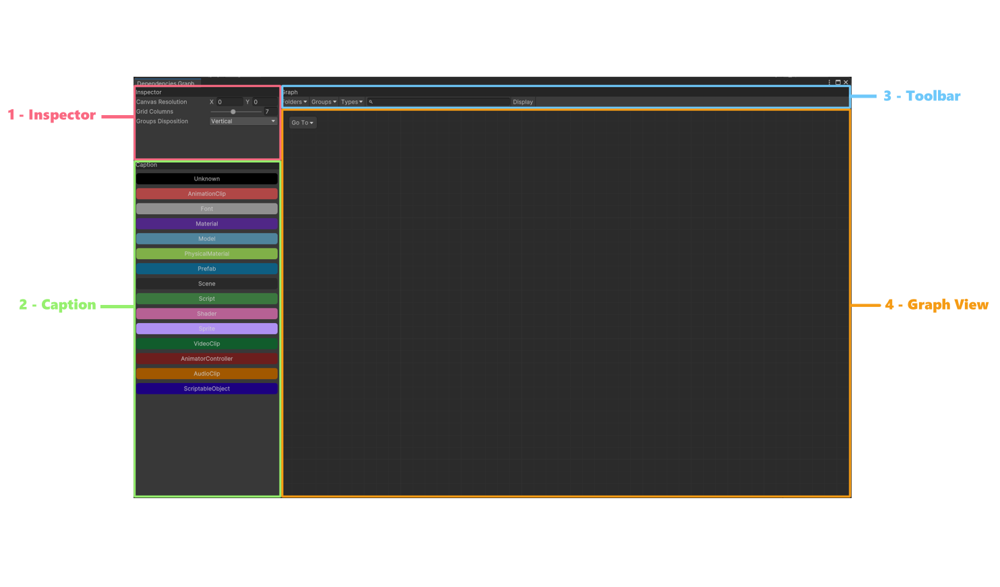
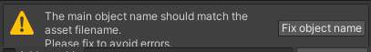
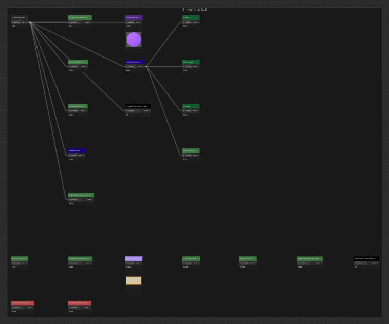
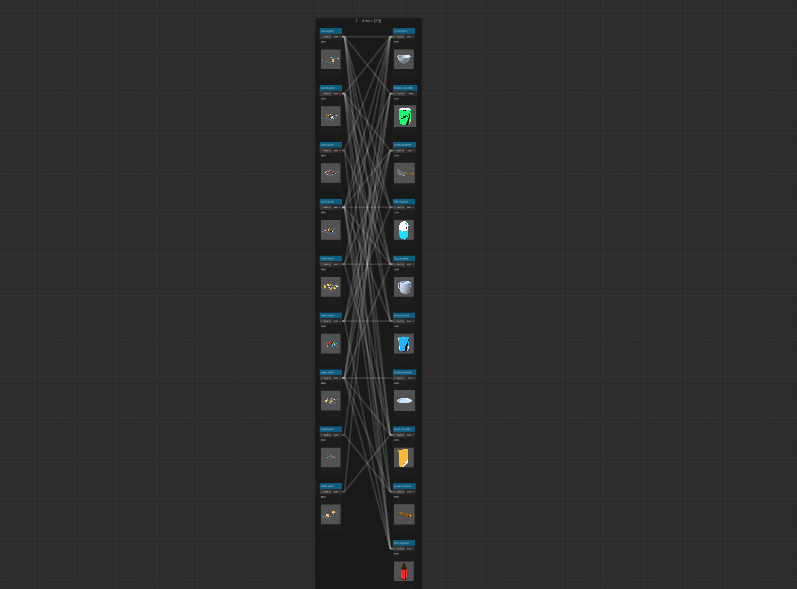
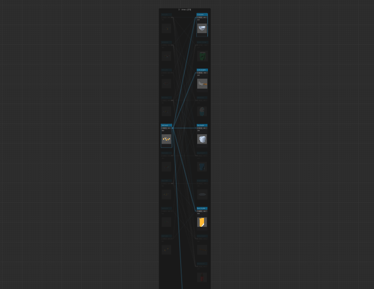

# Dependecies Graph

[<- Back](../../../../README.md)


## Introduction

This asset is an editor window to easily display dependencies between your assets in an Unity project. Using this tool you can see which assets are unused and clean your project. This window is built with the UI Toolkit using only scripts. 

To open this window go in `Window -> Dependencies Graph`.

## Window Overview

The editor window is divided in four sections:



### 1 - Inspector

This part allows you to customize the way to render the graph to fit your project.

### 2 - Caption

It's a simple caption to easily understand which type of assets are displayed in the graph.

### 3 - Toolbar

With this toolbar you can filter the graph to make it easier to read and to find the asset you want.

### 4 - Graph View

This view will contain the assets graph once you click on the Display button. It also contains a *Go To* button to easily navigate in the graph once it is displayed.

## Graph Features

### Groups

All visible assets in the graph are grouped by scene that uses them. Also you have three additional groups :
- Common : Contains all assets used by multiple scenes.
- Unused : Contains all assets without any dependencies and not used in the project.
- Corrupted : Contains all assets incompatible with the graph. 

  For instance, assets who reference themself because of a wrong naming for animation clip and script with this message in the inspector :



Each groups are divided in two subgroups. The first one who contains the group graph with assets link to each others. And the second one is the grid who contain assets without visible link.



### Selection

This graph have an interesting selection feature. Without filters you can see some graph like this:



However, by selecting an asset you can easily see each of its dependencies:



:warning: **If a lot of assets are displayed**: The first selection should be laggy but the other ones will work fine.

The second feature of the selection are intergroups links. Because the graph doesn't display link between groups to avoid a lot of complexity in the readability of the graph, it may cause an issue because you cannot know where youre assets are used in the common group. So, when you select an asset, you can see its intergroups links to know where it is used.

### Asset information

For each asset in the graph you can see the runtime memory size which is calculated with this method:

```cs
Profiler.GetRuntimeMemorySizeLong(asset)
```
An asset can have a preview if it is supported by the editor window as you can see in the previous screens. This graph supports previews for UI prefabs but you need to fill youre project Canvas resolution in the Inspector part of the window before running a display. For more information on how it works you can see the code [here](Utils/GraphNodePreviewLoader.cs).

## :warning: Known issues

### 1. Addressable assets

For the creation of the graph we need to found links between assets and we use this method:

```cs
AssetDatabase.GetDependencies(pathName, recursive)
```

However, it doesn't work with `AssetReference` of addressable assets. It is fixed only on `ScriptableObject` assets by reading the file and searching for all the GUID referenced inside of it. This fix cannot be applyed to all assets because it's way more time consuming than the `AssetDatabase` static method.

If you want to customize it for your project go in the method `InitGraphAsync()` in this [script](Utils/Builders//GraphBuilder.cs).


### 2. Not all assets are visible

Some assets are hidden on purpose to simplify the graph. Folders and assemblies are obiously hidden because they don't have any link and are not useful for the graph. 

The second case is about scripts without link in the graph. **This tool does not support script graphs**, these, some script marked as unused but they can be used by other script.

### 3. After moving the package

The styles of the window are referenced with their path. So if you move the package it will break so to fix it you need to update the root path in this [script](Utils/GraphPath.cs).